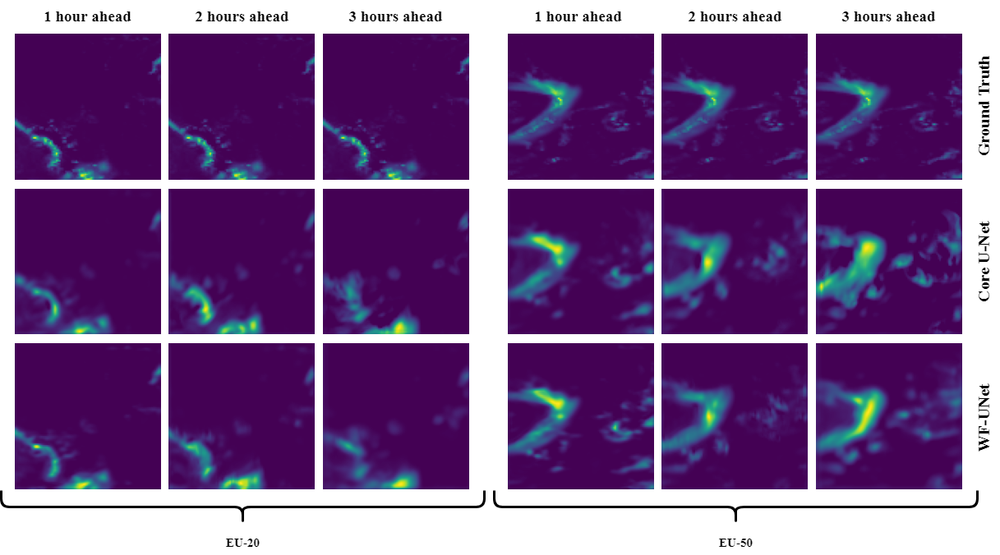
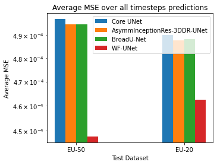
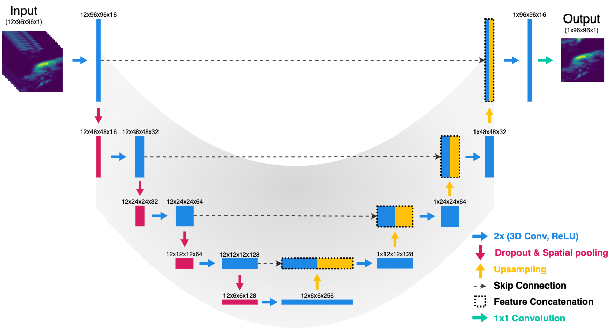
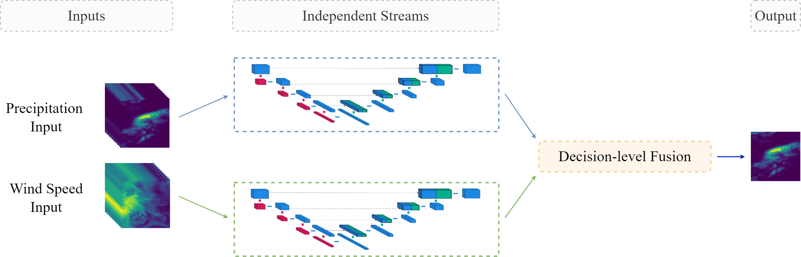

WF-UNet: Weather Data Fusion using 3D-UNet for Precipitation Nowcasting
========

The official code of the following paper: (link to paper)

Results
-----
WF-UNet and Core U-Net precipitation prediction examples for multiple timesteps ahead. The images in the left side are generated with the test set from the dataset containing at least 20% of rain pixels (EU-20). The images in the right side are generated with the test set from the dataset containing at least 50% of rain pixels (EU-50).

Average test MSE values over all timesteps ahead of the tested models for the EU-50 and EU-20 datasets.

Installation
-----

The required modules can be installed  via:

.. code:: bash

    pip install -r requirements.txt
    
Quick Start
~~~~~~~~~~~
After placing the the raw .nc datasets in the "dataset" folder, the following command will create the final dataset in a HDF5 format, contain the training and test set ready to use for modelling.

.. code:: bash

    python create_datasets.py 

The models which use only precipitation images can be trained running the following command:

.. code:: bash

    python training_rain.py 
    
while the WF-UNet model with the following command: 

.. code:: bash

    python training_rain_wind.py 

To evaluate the models and visualize some predictions, please run:

.. code:: bash

    python evaluation_and_predictions.py 
    

Scripts
-----

- The scripts contain the models, the generators, the training files and evaluation files.

Core U-Net architecture
-----

WF-UNet architecture
-----

  
Data and pretrained models
-----

In order to download the data or any of the trained models, please email to the following address:

siamak.mehrkanoon@maastrichtuniversity.nl

The data must be downloaded and unzipped inside the 'dataset/' directory as indicated in the txt files inside them.
 

